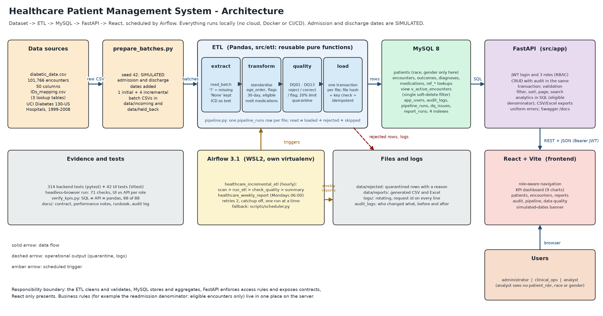
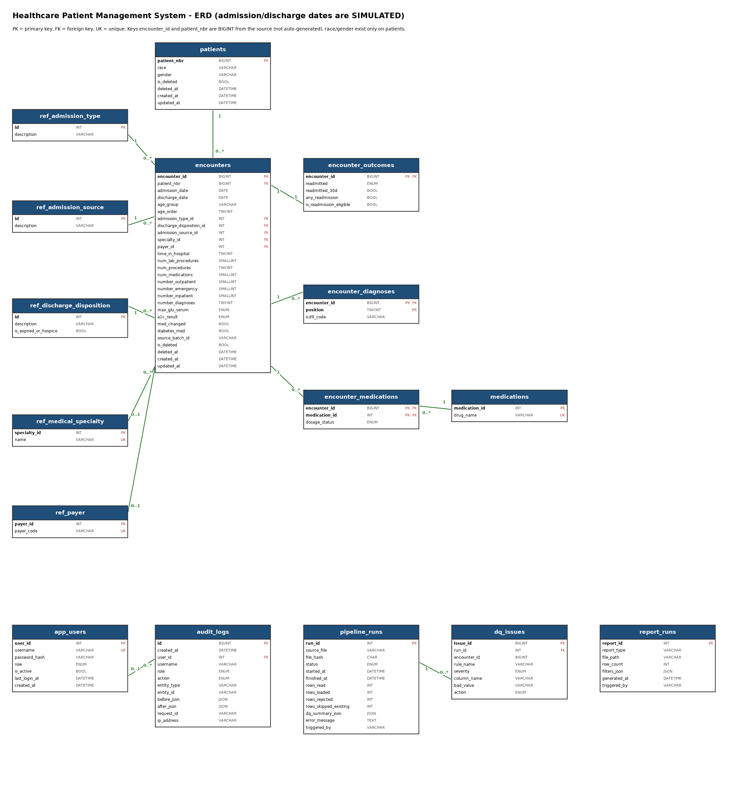

# Design Document: Healthcare Patient Management System

Educational capstone on the UCI *Diabetes 130-US Hospitals (1999-2008)* extract. Educational use only.
Source of truth for every statement below: the repository (`docs/decision_log.md`, `docs/data_contract.md`, `docs/performance_notes.md`, the code and its tests). Numbers were measured on the final system.

> **Read this first.** Admission and discharge dates are **simulated** (the dataset has no dates), so every trend is illustrative. The data has **no hospital identifier**, so no hospital-level claim is made. The data is observational: findings are *associated with*, never *caused by*.

## 1. Problem statement
A hospital operations team holds a research extract of 101,766 inpatient encounters of 71,518 diabetic patients. It arrives as a flat CSV with coded values, missing-value markers, no dates and no controls. The team needs a trustworthy system that loads new files repeatedly without double counting, rejects or flags bad rows with evidence, stores the data in a relational model, exposes it through a secured API with role-based access, and answers questions on a dashboard and in exports.

## 2. Business questions
1. What is the 30-day readmission rate, and how does it differ by age group, admission type, discharge disposition and specialty?
2. How long do patients stay, and which groups stay longest?
3. How do admissions and readmissions change over time (using simulated dates)?
4. Which medication, lab-test and prior-utilisation patterns are associated with readmission?

**Headline result (full data, eligible denominator):** 101,766 encounters, 71,518 patients, average stay 4.40 days, 30-day readmission rate **0.113888** (11,314 / 99,343 eligible encounters). Dividing by all encounters would give 0.111177, a plausible but wrong number; the denominator is stated in every analytics response.

## 3. Architecture

Data flow: `diabetic_data.csv` and `IDs_mapping.csv` -> `scripts/prepare_batches.py` (adds simulated dates, writes one initial and four incremental batch files) -> **ETL** (`extract`, `transform`, `quality`, `load`, orchestrated by `pipeline.py`) -> **MySQL** -> **FastAPI** (authentication, role checks, audit, CRUD, analytics, exports) -> **React** dashboard. **Airflow** triggers the incremental ETL hourly and the weekly reports; a rotating log, a quarantine folder (`data/rejected`) and a reports folder (`data/reports`) hold the operational output.

Responsibilities are separated so each rule lives once: the ETL cleans and validates; MySQL stores and aggregates; FastAPI enforces access and exposes contracts; React only presents. No rate is ever computed in the browser. Everything runs locally; there is no Docker, cloud or CI/CD.

| Layer | Technology |
|---|---|
| ETL | Python 3.12, pandas 3 (pure functions), SQLAlchemy 2.0 |
| Database | MySQL 8.4 with a least-privilege application user |
| API | FastAPI, Pydantic v2, JWT (HS256), bcrypt |
| Front end | React 19, Vite, Recharts, axios, react-router |
| Scheduling | Apache Airflow 3.1 (own virtualenv in WSL2); APScheduler fallback |
| Tests | pytest, Vitest and Testing Library, headless-Chrome end-to-end run |

## 4. Data model

Sixteen tables: `patients`, `encounters`, `encounter_outcomes`, `encounter_diagnoses`, `encounter_medications`, `medications`, five `ref_*` lookups, `app_users`, `audit_logs`, `pipeline_runs`, `dq_issues`, `report_runs`. Full key list: `docs/schema_design.md`; DDL: `db/schema.sql` (generated from the models, so they cannot drift).

**Normalisation reasoning (third normal form, stopping there).**
- Race and gender are patient attributes: they live on `patients` only, once, in one place that can be hidden from analysts. Age stays on `encounters` because it changes between visits.
- Diagnoses (`diag_1..3`) were a repeating group; they became rows of `encounter_diagnoses`. Medications became a long table holding only `Steady`, `Up` and `Down`: storing the "No" cells would have written 2,137,086 rows, 94.4% of them noise, against 120,054 stored.
- Coded categories are lookup tables with descriptions and foreign keys; closed sets (`readmitted`, dosage status, lab results, roles) are ENUMs.
- `encounter_id` and `patient_nbr` are source keys, not auto-increment, so reloading never renumbers data and duplicate detection stays meaningful.
- Outcome flags (`readmitted_30d`, `any_readmission`, `is_readmission_eligible`) are stored once by a single writer rather than derived in every query, so there is exactly one definition of the eligible denominator.
- Soft delete (`is_deleted`) keeps history; the view `v_active_encounters` is the single filter point (it also excludes encounters of deleted patients and never exposes race or gender).
- Rejected rows never reach `encounters`, so `dq_issues.encounter_id` deliberately has no foreign key.
- No hospital table exists because no hospital data exists.

## 5. ETL design
**Extract.** Read with `keep_default_na=False, na_values=['?','']`; the text `None` in the two lab columns is a real value (default pandas would have removed 96,420 and 84,748 of them). ICD-9 codes stay strings.

**Transform** (pure functions with no I/O, unit-tested on a small fixture): snake_case names, `age_order`, derived outcome flags, melted medications, removal of `weight` (96.86% missing), `examide` and `citoglipton` (constant).

**Quality rules DQ01-DQ13.** Reject what would break keys or analytics (DQ01-05, 07-10), correct what can be nulled without losing the row (DQ06, ICD format), flag what is suspicious but legitimate (DQ12 gender `Unknown/Invalid`, DQ13 conflicting demographics) and measure missingness (DQ11). Rejected rows are quarantined in `data/rejected/<batch>_rejected.csv` with the rule and reason and logged in `dq_issues`. A file whose rejected share exceeds 20% fails as a whole and loads nothing, because a mostly bad file is more likely a wrong file or a broken export than a few dirty rows. Two rules were tuned on real data: DQ06 accepts short numeric codes (a strict rule would have corrected 5,732 genuine codes) and DQ08 allows discharges up to 14 days after the study window.

**Incremental strategy: file hash plus key check, no date watermark.** The SHA-256 of a file stops identical bytes being processed twice (run status `SKIPPED_DUPLICATE_FILE`); a pre-selected `encounter_id` check stops the same rows arriving in a different file. A date watermark was rejected because late-arriving rows would be lost forever. `INSERT IGNORE` is not used: it hides truncation and foreign-key errors.

**Transactions and reconciliation.** One transaction per file: a crash leaves nothing behind. A real hard-kill test (process killed holding 103,861 uncommitted rows) kept none of them and the retry loaded all 81,412. Every run reconciles `read = loaded + rejected + skipped` inside the transaction; a mismatch rolls back. Each run writes a `pipeline_runs` row (status `RUNNING`, `SUCCESS`, `FAILED`, `SKIPPED_DUPLICATE_FILE`); a stale `RUNNING` row from a killed process is closed as `FAILED` on the next attempt.

| Run | File | Result |
|---|---|---|
| 1 | initial batch | 81,412 read, 81,412 loaded, 0 rejected (about 12 s) |
| 2 | batch 001 | 5,089 loaded |
| 3 | batch 001 again | `SKIPPED_DUPLICATE_FILE`, no work |
| 4 | reordered copy of batch 001 under a new name | 5,089 read, 0 loaded, 5,089 skipped as existing |
| 5 | faulty batch (injected faults) | 5,065 loaded, 23 quarantined with reasons, 5 ICD codes corrected |
| 13 | batch 003 after the above | 23 previously rejected rows loaded; dataset complete at 101,766 |

**Scheduling (Airflow).** Two DAGs: `healthcare_incremental_etl` (hourly; `scan_for_new_files` >> `run_etl` >> `check_quality` >> `record_summary`; `catchup=False`, one active run, two retries) and `healthcare_weekly_report` (Mondays 06:00). DAG tasks only call existing scripts, so Airflow, the fallback scheduler and the command line share one implementation. Airflow runs in its own environment because its pinned dependencies conflict with FastAPI. A demonstrated severe-faulty file (30% bad) failed after three tries and loaded nothing; a repeat trigger with no new file was a successful no-op.

## 6. API design
Authentication: `POST /auth/login` returns a 60-minute HS256 token containing only `sub`, `role`, `iat` and `exp`. The role is read from the database on every request, so a forged role claim is useless and deactivating a user takes effect at once. One message covers unknown user, wrong password and inactive user, with a dummy bcrypt check so timing does not reveal valid usernames. The service refuses to start without a strong `JWT_SECRET`.

**Roles and permissions** (one constant, `app/permissions.py`; a test compares it with this table):

| Capability | administrator | clinical_ops | analyst |
|---|---|---|---|
| Dashboards, aggregated exports | yes | yes | yes |
| List and search encounters | yes | yes | yes, without `patient_nbr` |
| Export encounter-level data | yes | yes | no |
| View patients (race, gender) | yes | yes | no (403) |
| Create and update records | yes | yes | no |
| Soft-delete records | yes | no | no |
| Pipeline runs, data-quality issues | yes | yes | no |
| Audit logs, user management | yes | no | no |

**Contracts.** 32 operations (full reference: `docs/API_Documentation.pdf`). Lists use one envelope `{items, total, page, page_size, pages, meta}`; `page_size` is capped at 100; sorting uses a whitelist plus the primary key as tie-breaker (verified by walking every page on every sort column: each row exactly once). Errors always use `{"error": {"code", "message", "details"}}` and never contain a stack trace or SQL. Validation is shared with the ETL, so a record is accepted by the API exactly when the pipeline would accept it. Readmission flags are always derived on the server; a client cannot send them.

## 7. Security, roles and privacy
- Roles are enforced on the server; hiding buttons in the interface is only convenience. A real-browser run compares what the interface shows with the API's answer for the same call, per role (`docs/role_verification.md`: all agree).
- Data minimisation: race and gender exist only on `/patients` (403 for analysts); analyst encounter responses omit `patient_nbr` (the keys are absent, not null) and analysts cannot filter by `patient_nbr`, which would re-identify rows. Exports use an explicit column allow-list.
- Audit: every create, update, delete and encounter-level export writes an `audit_logs` row with before and after values **in the same transaction** as the change. Tests force a failing audit write and a failing commit: neither the data nor an audit row remains.
- Passwords are stored as bcrypt hashes; tokens, passwords and sensitive demographics never appear in logs or error responses; small groups (fewer than 11 encounters) are flagged `small_n`.
- Database account `hc_app` can reach only the two project schemas.

## 8. Performance and indexes
Measured on a scratch copy with all 101,766 encounters plus 300,000 synthetic audit rows (median of five runs after a discarded cold run, with `EXPLAIN` and `EXPLAIN ANALYZE`; `docs/performance_notes.md`).

| Query | Before | After | Index or change |
|---|---|---|---|
| Encounters in a date range, newest first | 256.3 ms | 0.8 ms | `ix_encounters_is_deleted_admission_date` |
| Monthly trend for one year | 287.1 ms | 63.9 ms | same index |
| ICD-9 prefix search | 765.1 ms | 9.1 ms | `ix_encounter_diagnoses_icd9_code` |
| Audit log, newest first | 85.6 ms | 0.6 ms | `ix_audit_logs_created_at` |
| Audit trail of one record | 64.6 ms | 0.3 ms | `ix_audit_logs_entity` |

Two findings matter beyond the indexes. A fifth, `audit_logs (username, created_at)`, looked right on paper but did not help, so it was **rejected on evidence**. And the largest single gain was not an index: the view joined `patients` only to hide deleted patients, which made the optimizer scan patients first. Rewriting that check as `NOT EXISTS` fixed the plan (ICD search 765 -> 68 ms before any index). Loading all batches costs 22.2 s without and 23.8 s with the indexes (+7%). Two analytics queries (readmission by age group and top drugs) still take 0.6-0.8 s because they must read every encounter; a pre-aggregated summary table was **rejected for now** (staleness and an extra step to save about half a second) and is revisited at about ten times the data.

## 9. Testing strategy
- **Backend (pytest, `healthcare_test` only; the fixture refuses any other database):** transform and each DQ rule on a hand-built fixture; load, idempotency, forced-failure rollback and reconciliation against the real MySQL schema; every endpoint with all three roles; the permission matrix against this document; soft-delete invisibility; stable paging; audit atomicity; KPI numbers against a hand-calculated 40-row fixture. 314 tests.
- **Cross-checks on real data:** `scripts/verify_kpis.py` recomputes every headline and grouped KPI in pandas from the raw CSV and compares SQL and API: 88 of 88 checks.
- **Front end:** 42 Vitest and component tests (stale-response guard, role guards, form rules) and a headless-Chrome run of 71 checks that drives the real UI for each role against the API and regenerates the screenshots.
- **What is mocked:** nothing in the database layer; loaders, analytics and RBAC are tested against the real schema, because a mocked database passes even when the SQL is wrong. The front-end unit tests mock the API client only.
- **Known gaps:** see `docs/test_report.md` (no real tablet or screen-reader test, no opening the Excel files in Excel itself, Airflow only tested on 3.1, UI trigger by hand not exercised).

## 10. Deviations and limitations
1. **Simulated dates.** Seeded, sorted and assigned in encounter order; labelled in the interface, in `meta.dates_simulated` and in every document. The pipeline rules (incremental loading, date validation) are real; the trends are not clinical findings.
2. **No hospital identifier.** "Which hospital has the highest readmission rate?" cannot be answered; categories are compared instead and the limitation is stated.
3. **Observational data.** Associations only; no causal or predictive claim and no risk model.
4. **Heavy missingness** in medical specialty (49%) and payer (40%); group comparisons describe the recorded subset.
5. **Repeated patients.** Encounters are not independent; rates are per encounter.
6. **Old data (1999-2008).** Not a description of current practice.
7. **Local only.** No cloud, Docker or CI/CD; Airflow runs in WSL2 on a laptop; passwords for demo users are local.

## 11. Trade-offs
| Decision | Alternative | Why chosen | Cost |
|---|---|---|---|
| Simulated seeded dates | no dates | gives trends, date filters and incremental loads | every trend is illustrative |
| File hash + key check | date watermark | late rows are never lost | one indexed lookup per chunk |
| One transaction per file | commit per chunk | no half-loaded file | long transaction on big files |
| Reject whole file above 20% | always load good rows | a mostly bad file is probably the wrong file | a dirty but important file waits for a fix |
| Stored outcome flags | derive in each query | one definition of the denominator, indexable | three columns that could drift (tested) |
| Soft delete + one view | hard delete | audit and undo | every query must use the view (tested) |
| Medications: only Steady/Up/Down rows | all "No" rows too | about 18x fewer rows | a missing row means "not prescribed" |
| Rates computed in Python from integer counts | SQL division | MySQL division keeps 4 decimals | one more place that formats numbers |
| Audit inside the data transaction | separate audit write | no change without its trail | an audit failure blocks the change |
| JWT without refresh tokens | refresh tokens | no server-side token store | sign in again each hour |
| Token in sessionStorage | localStorage | not shared across tabs, gone when the tab closes | sign in per tab |
| Pandas | Spark | 100k rows fit in memory; no setup cost | would need rework at much larger scale |
| NOT EXISTS view, no summary table | pre-aggregated table | correct plan, no staleness | two queries stay at 0.6-0.8 s |
| Airflow in WSL2 with its own environment | Airflow in the project environment | dependency conflicts avoided | two operating environments |

## 12. Future work
Real admission timestamps; a hospital dimension if the data ever contains one; a validated risk model with calibration (the current system is descriptive); alerting on failed pipeline runs (email or chat); a summary table or partitioning by admission date, read replicas and queued exports at roughly 100 times the data; automated cross-browser and accessibility testing. No cloud or CI/CD claims are made for the current system.
